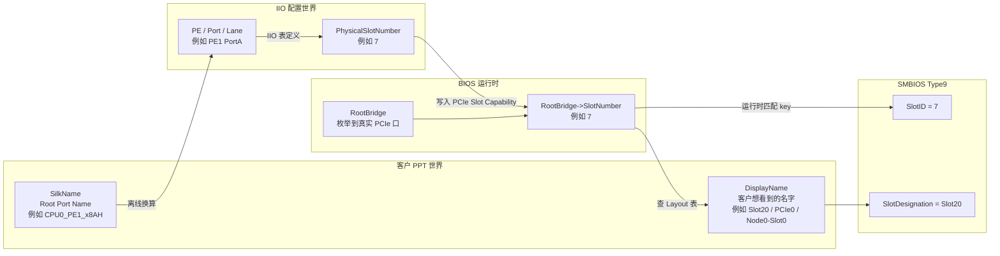
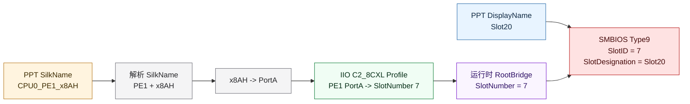
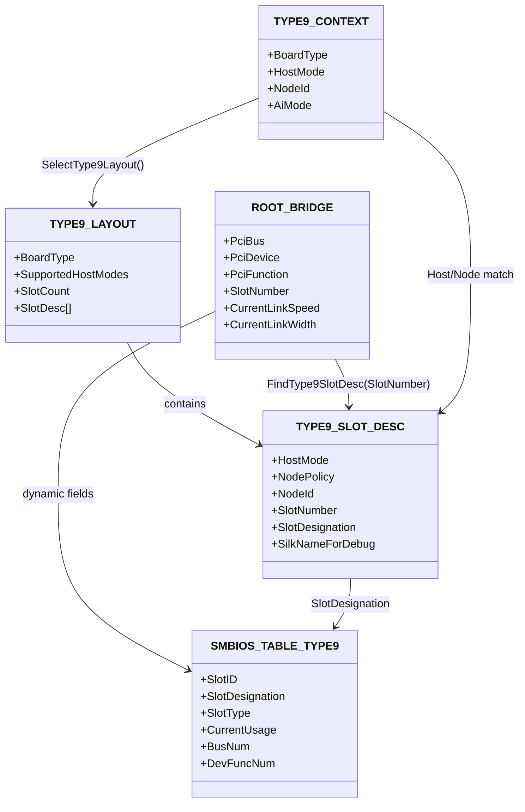
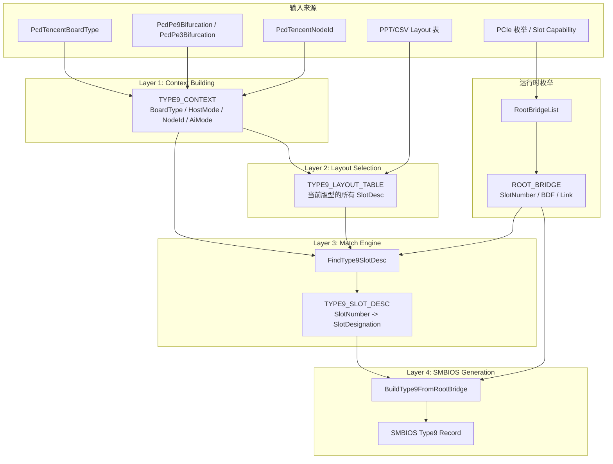
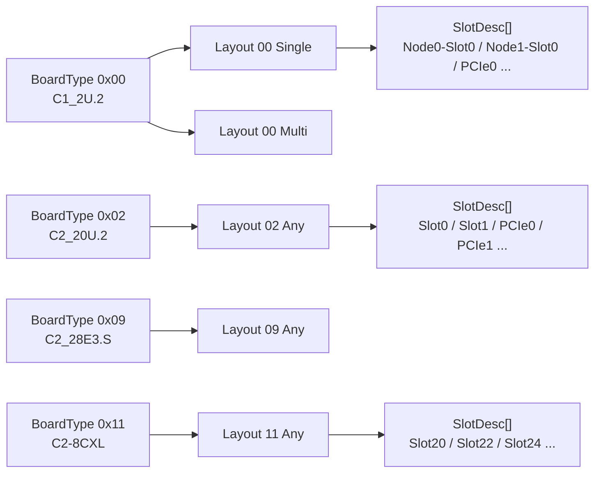
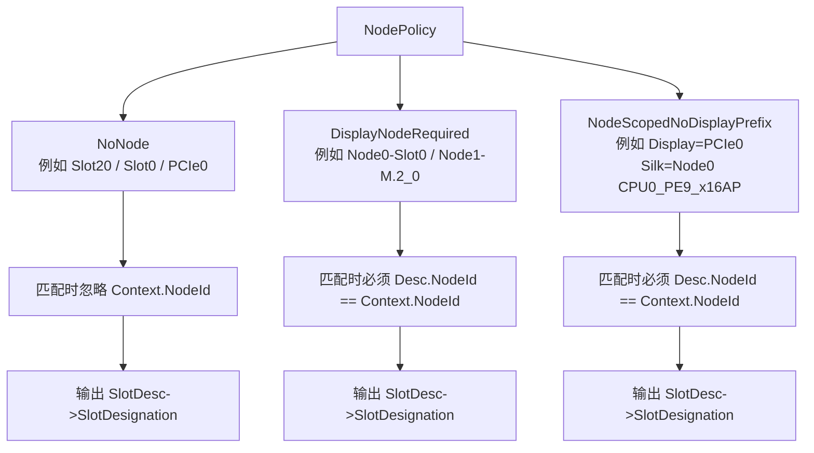
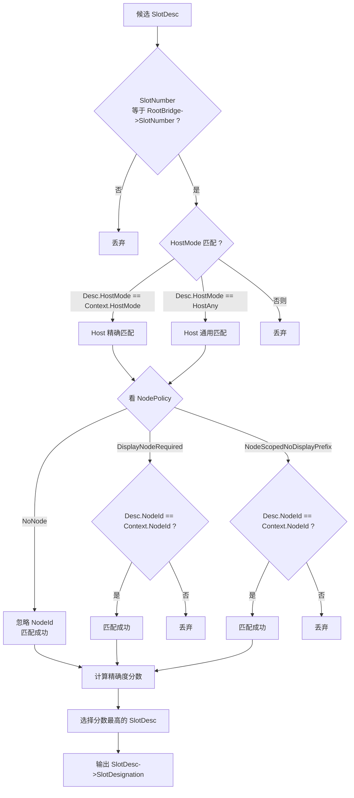
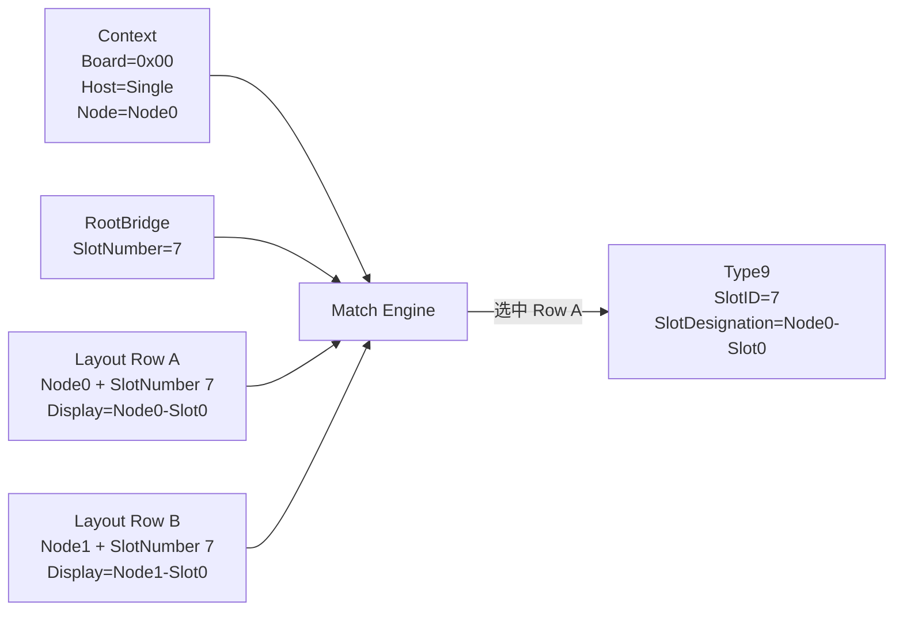
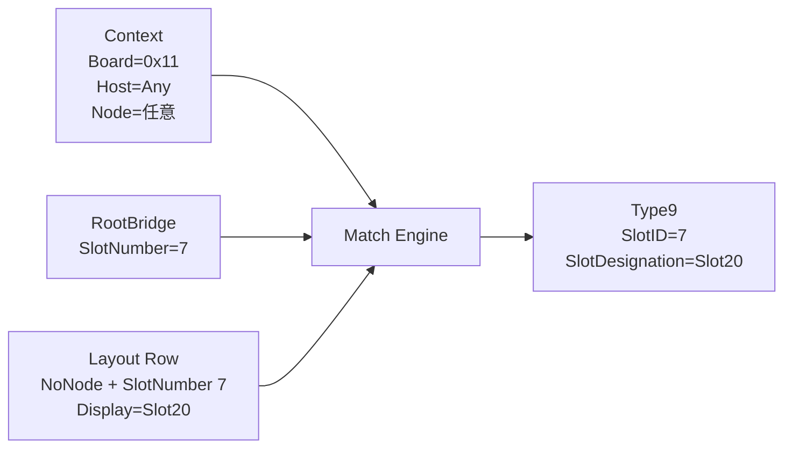
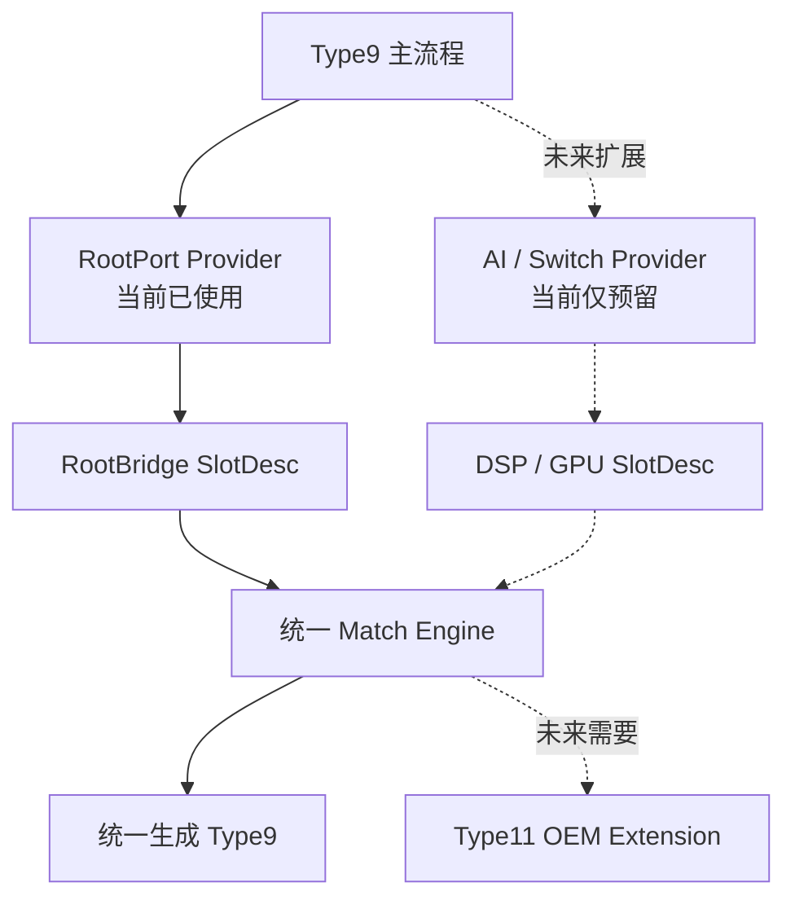

# V5 Type9 重构逻辑详细讲解

这份文档只做一件事：把 V5 Type9 的新架构讲明白。

你先不用急着看函数名。Type9 这块最容易晕，是因为它同时出现了三个很像的概念：

- `SlotNumber`
- `SlotDesignation` / `DisplayName`
- `SilkName`

如果这三个没分清，后面的 `Context`、`Layout`、`NodePolicy`、fallback 都会搅在一起。

## 1. 先抓住一句话

V5 Type9 的核心任务是：

```text
BIOS 枚举到一个真实 PCIe 口。
这个口的硬件 SlotNumber 是 X。
现在要根据当前版型，查 PPT 映射表，看看 X 应该显示成什么名字。
```

最终写进 SMBIOS Type9 的两个关键字段是：

```text
Type9.SlotID          = 硬件 SlotNumber
Type9.SlotDesignation = PPT 里的显示名 DisplayName
```

比如 C2-8CXL 里：

```text
硬件 SlotNumber = 7
PPT 显示名      = Slot20
```

那最终 Type9 就是：

```text
SlotID          = 7
SlotDesignation = "Slot20"
```

注意：这里 `Slot20` 不是硬件 SlotNumber 20。它只是客户 PPT 要显示的名字。

## 2. 三个名字：SlotNumber、DisplayName、SilkName

### 2.1 SlotNumber 是硬件编号

`SlotNumber` 来自 IIO 配置，最后写进 PCIe Slot Capability。

V5 Type9 运行时会枚举 PCIe Root Port，然后读 Slot Capability：

```c
RootBridge->SlotNumber = (UINT16)(SlotCap >> 19);
```

它是硬件视角的编号，应该写进 Type9 的 `SlotID`。

### 2.2 DisplayName 是客户最终看到的名字

`DisplayName` 是 PPT 里的“物理位置”或“网卡物理位置”，例如：

```text
Slot0
Slot20
PCIe0
Node0-Slot0
Node1-M.2_0
```

它应该写进 Type9 的 `SlotDesignation`。

### 2.3 SilkName 是映射证据

`SilkName` 是 PPT 里的 Root Port Name，例如：

```text
CPU0_PE1_x4AD
CPU0_PE1_x8AH
Node0 CPU0_PE9_x16AP
```

它告诉我们这个显示位置接在哪个 `PE/Port/Lane` 上。我们可以离线用它推导 SlotNumber，但运行时不应该主要靠 silkname 匹配。

### 2.4 三者关系图



这张图是全局关键。

你可以这么记：

```text
SilkName 用来帮助我们建表。
SlotNumber 用来运行时匹配。
DisplayName 用来最终显示。
```

## 3. 为什么不能把 DisplayName 的数字当 SlotNumber

最典型例子是 `11:C2-8CXL`。

PPT 里有一行：

```text
DisplayName = Slot20
SilkName    = CPU0_PE1_x8AH
```

根据 silkname：

```text
CPU0_PE1_x8AH
  -> PE1
  -> x8AH
  -> PortA
```

再查 IIO 的 `C2_8CXL` profile：

```text
PE1 PortA -> SlotNumber 7
```

所以这行真正含义是：

```text
SlotNumber 7 在 C2-8CXL 版型里显示为 Slot20
```

图示如下：



所以千万不要写：

```text
DisplayName = Slot20
所以 SlotNumber = 20
```

这个是错的。

## 4. 新架构里四个核心对象

新方案里最重要的是四个对象：

```text
Context
Layout
RootBridge
SlotDesc
```

### 4.1 Context：当前机器状态

`Context` 负责回答：

```text
我现在是哪种机器？
我是 Single 还是 Multi？
我是 Node0 还是 Node1？
当前是否启用 AI Provider？
```

示例：

```c
typedef struct {
  UINT8            BoardType;
  TYPE9_HOST_MODE  HostMode;
  TYPE9_NODE_ID    NodeId;
  TYPE9_AI_MODE    AiMode;
} TYPE9_CONTEXT;
```

来源：

```text
BoardType -> PcdTencentBoardType
HostMode  -> PcdPe9Bifurcation / PcdPe3Bifurcation
NodeId    -> PcdTencentNodeId
AiMode    -> 当前先 Type9AiModeNone
```

### 4.2 Layout：当前版型的 PPT 映射表

`Layout` 是静态表，来自 PPT/CSV。

它回答：

```text
在当前版型下，某个 SlotNumber 应该显示成什么？
```

一行 Layout 表就是一个 `SlotDesc`。

### 4.3 RootBridge：真实枚举到的 PCIe 口

`RootBridge` 是运行时从 PCI 总线枚举出来的端口。

它包含：

```text
Bus / Dev / Func
SlotNumber
LinkSpeed
LinkWidth
SecondaryBus
SubordinateBus
HotPlugFlag
```

它代表真实硬件，不代表客户显示名。

### 4.4 SlotDesc：匹配到的显示描述

`SlotDesc` 是 Layout 表里的一行。

它包含：

```text
HostMode
NodePolicy
NodeId
SlotNumber
SlotDesignation
SilkNameForDebug
```

最终 Type9 使用：

```text
SlotDesc.SlotDesignation
```

作为显示名。

### 4.5 四个对象关系图



## 5. 整体流程：一条 Type9 是怎么生成的

可以把主流程看成 9 步，但真正关键的是 3 步。

```text
Step 1: Locate AMI SMBIOS Protocol
Step 2: DeleteAllType9Records
Step 3: BuildType9Context
Step 4: SelectType9Layout
Step 5: FindAllRootBridgeAndDownStreamPort
Step 6: FindType9SlotDesc
Step 7: 使用 SlotDesc->SlotDesignation
Step 8: BuildType9FromRootBridge
Step 9: CleanUpRootPortList
```

其中核心是：

```text
BuildType9Context
SelectType9Layout
FindType9SlotDesc
```

### 5.1 架构图



## 6. SelectType9Layout：先选哪张表

`SelectType9Layout` 做的是：

```text
根据 BoardType 和 HostMode，选择当前应该使用哪张 Layout 表。
```

比如：

```text
BoardType = 0x00，HostMode = Single
  -> gType9Layout_00_Single

BoardType = 0x00，HostMode = Multi
  -> gType9Layout_00_Multi

BoardType = 0x11，HostMode = Any
  -> gType9Layout_11_Any
```

这里的表不是 IIO 表，而是 Type9 显示映射表。

IIO 表负责：

```text
PE/Port -> SlotNumber
```

Type9 Layout 表负责：

```text
SlotNumber -> DisplayName
```

### 6.1 BoardType 到 Layout 的关系



## 7. FindType9SlotDesc：再从表里找哪一行

这一步是最核心的匹配。

输入：

```text
Layout
Context.HostMode
Context.NodeId
RootBridge->SlotNumber
```

输出：

```text
SlotDesc
```

也就是：

```text
当前这个 RootBridge 的 SlotNumber，在当前机器状态下，应该显示成什么？
```

## 8. NodePolicy：它不是用来拼字符串的

这一点非常重要。

`NodePolicy` 的职责是：

```text
决定匹配时要不要看 NodeId。
```

它不负责生成显示名。

最终显示名应该永远直接来自：

```text
SlotDesc->SlotDesignation
```

不要运行时拼：

```c
"node%u-%a"
```

因为 PPT 里的显示名可能是：

```text
Node0-Slot0
Node0-M.2_0
PCIe0
Slot20
```

格式并不统一。运行时拼字符串容易拼错。

### 8.1 三种 NodePolicy

| NodePolicy | 含义 | 匹配 NodeId 吗 | 输出时怎么显示 |
|---|---|---|---|
| `NoNode` | 这个版型没有 node 显示概念 | 不匹配 NodeId | 直接用表里的 DisplayName |
| `DisplayNodeRequired` | PPT 显示名本身带 Node | 必须匹配 NodeId | 直接用表里的 DisplayName |
| `NodeScopedNoDisplayPrefix` | 硬件/上下文有 Node，但显示名不带 Node | 必须匹配 NodeId | 直接用表里的 DisplayName |

### 8.2 NodePolicy 图



看这个图的重点：

```text
三种策略最后都直接输出表里的 SlotDesignation。
区别只在匹配阶段。
```

## 9. 为什么截图里的 Apply Node Policy 要小心

截图里有类似逻辑：

```c
if (SlotDesc->NodePolicy == Type9NodePolicyDisplayNodeRequired) {
  AsciiSPrint(SlotDesignationWithNode, "node%u-%a", Context.NodeId, SlotDesc->SlotDesignation);
} else {
  AsciiSPrint(SlotDesignationWithNode, "%a", SlotDesc->SlotDesignation);
}
```

这个思路容易出问题。

### 9.1 问题 1：大小写和格式可能不符合 PPT

PPT 里可能是：

```text
Node0-Slot0
```

但代码拼出来可能是：

```text
node0-Slot0
```

大小写已经不一致。

### 9.2 问题 2：有些显示名不是 Slot

PPT 里可能是：

```text
Node0-M.2_0
```

如果代码按 `node%u-%a` 拼，很容易拼不对。

### 9.3 问题 3：可能重复拼

如果 Layout 表里已经存了完整显示名：

```text
Node0-Slot0
```

运行时再拼：

```text
node0-Node0-Slot0
```

就错了。

所以建议：

```c
AsciiSPrint(SlotDesignation, Size, "%a", SlotDesc->SlotDesignation);
```

也就是：

```text
NodePolicy 只用于匹配，不用于拼显示名。
```

## 10. 匹配算法：从 4-pass 到“规则匹配 + 选择最优”

### 10.1 4-pass 的意思

内网模型写的 4-pass 是：

| Pass | HostMode | NodeId | 含义 |
|---|---|---|---|
| 0 | 精确 | 精确 | 最严格 |
| 1 | 精确 | Any | 放宽 Node |
| 2 | Any | 精确 | 放宽 Host |
| 3 | Any | Any | 最宽松 |

它的思想是：

```text
先找最精确的。
找不到再找宽泛的。
```

这个思路没问题。

问题在于：如果它把 `NodeNone` 当成必须等于当前 NodeId 的值，就会把 `NoNode` 版型匹配错。

`NoNode` 的真实意思是：

```text
这个表项不关心 NodeId。
```

不是：

```text
必须 Context.NodeId == NodeNone。
```

### 10.2 更清楚的写法

我建议不用死板 4-pass，而是写成三个判断：

```text
1. SlotNumber 必须相等。
2. HostMode 必须匹配，或者表项是 HostAny。
3. Node 是否匹配，由 NodePolicy 决定。
```

然后如果多条都能匹配，选最精确的。

### 10.3 决策图



## 11. 打分制到底是什么

打分制不是机器学习，也不是复杂算法。

它只是：

```text
多个表项都能匹配时，谁更精确，谁优先。
```

比如：

```text
Host 精确匹配 > HostAny
Node 精确匹配 > NoNode
```

可以打分：

```text
Host 精确 +100
HostAny   +10
Node 精确 +100
NoNode    +1
```

这样一眼就知道：

```text
完全精确匹配分最高。
通用 fallback 分低。
```

### 11.1 示例

当前：

```text
Context.HostMode = Multi
Context.NodeId   = Node0
SlotNumber       = 39
```

表里有三行：

| 行 | HostMode | NodePolicy | NodeId | SlotNumber | DisplayName |
|---|---|---|---|---|---|
| A | Multi | DisplayNodeRequired | Node0 | 39 | PCIe0 |
| B | Any | DisplayNodeRequired | Node0 | 39 | PCIe0 |
| C | Multi | NoNode | None | 39 | PCIe0 |

打分：

```text
A = Host 精确 100 + Node 精确 100 = 200
B = HostAny 10 + Node 精确 100 = 110
C = Host 精确 100 + NoNode 1 = 101
```

所以选 A。

这就是“有精确用精确，没有精确才用通用”。

## 12. 推荐伪代码

```c
STATIC
BOOLEAN
Type9HostMatches (
  IN TYPE9_SLOT_DESC *Desc,
  IN TYPE9_CONTEXT   *Context,
  OUT INTN           *Score
  )
{
  if (Desc->HostMode == Context->HostMode) {
    *Score += 100;
    return TRUE;
  }

  if (Desc->HostMode == Type9HostModeAny) {
    *Score += 10;
    return TRUE;
  }

  return FALSE;
}
```

```c
STATIC
BOOLEAN
Type9NodeMatches (
  IN TYPE9_SLOT_DESC *Desc,
  IN TYPE9_CONTEXT   *Context,
  OUT INTN           *Score
  )
{
  switch (Desc->NodePolicy) {
  case Type9NodePolicyNoNode:
    //
    // NoNode 表示该显示名不关心 NodeId。
    // 不是要求 Context->NodeId 必须等于 NodeNone。
    //
    *Score += 1;
    return TRUE;

  case Type9NodePolicyDisplayNodeRequired:
  case Type9NodePolicyNodeScopedNoDisplayPrefix:
    if (Desc->NodeId == Context->NodeId) {
      *Score += 100;
      return TRUE;
    }
    return FALSE;

  default:
    return FALSE;
  }
}
```

```c
STATIC
TYPE9_SLOT_DESC *
FindType9SlotDesc (
  IN TYPE9_LAYOUT_TABLE *Layout,
  IN TYPE9_CONTEXT      *Context,
  IN UINT16              SlotNumber
  )
{
  TYPE9_SLOT_DESC *Best;
  INTN             BestScore;

  Best      = NULL;
  BestScore = -1;

  for (Index = 0; Index < Layout->SlotCount; Index++) {
    Desc  = &Layout->Slots[Index];
    Score = 0;

    if (Desc->SlotNumber != SlotNumber) {
      continue;
    }

    if (!Type9HostMatches (Desc, Context, &Score)) {
      continue;
    }

    if (!Type9NodeMatches (Desc, Context, &Score)) {
      continue;
    }

    if (Score > BestScore) {
      Best      = Desc;
      BestScore = Score;
      continue;
    }

    if (Score == BestScore) {
      DEBUG ((DEBUG_ERROR,
        "[TYPE9] Ambiguous layout match: Board=0x%x SlotNumber=%d\\n",
        Context->BoardType,
        SlotNumber
        ));
    }
  }

  return Best;
}
```

注意：这里没有任何拼显示名的逻辑。

生成 Type9 时直接：

```c
AsciiSPrint (OptionalStrStart, Size, "%a", SlotDesc->SlotDesignation);
```

## 13. 三个完整例子

### 13.1 例子一：C1_2U.2，Node0，SlotNumber 7

当前机器：

```text
BoardType = 0x00
HostMode  = Single
NodeId    = Node0
```

枚举到：

```text
RootBridge->SlotNumber = 7
```

Layout 表：

| HostMode | NodePolicy | NodeId | SlotNumber | DisplayName |
|---|---|---|---|---|
| Single | DisplayNodeRequired | Node0 | 7 | Node0-Slot0 |
| Single | DisplayNodeRequired | Node1 | 7 | Node1-Slot0 |

匹配：

```text
第一行：Host=Single 命中，Node=Node0 命中，SlotNumber=7 命中。
第二行：Host=Single 命中，Node=Node1 不命中。
```

结果：

```text
SlotID          = 7
SlotDesignation = Node0-Slot0
```

图示：



### 13.2 例子二：C2-8CXL，SlotNumber 7

当前机器：

```text
BoardType = 0x11
HostMode  = Any
NodeId    = None 或 Node0 都不重要
```

枚举到：

```text
RootBridge->SlotNumber = 7
```

Layout 表：

| HostMode | NodePolicy | NodeId | SlotNumber | DisplayName |
|---|---|---|---|---|
| Any | NoNode | None | 7 | Slot20 |

匹配：

```text
SlotNumber=7 命中。
HostMode=Any 可匹配。
NodePolicy=NoNode，忽略 Context.NodeId。
```

结果：

```text
SlotID          = 7
SlotDesignation = Slot20
```

图示：



### 13.3 例子三：C1 Multihost 网卡，SlotNumber 39

当前机器：

```text
BoardType = 0x00
HostMode  = Multi
NodeId    = Node1
```

枚举到：

```text
RootBridge->SlotNumber = 39
```

Layout 表可能是：

| HostMode | NodePolicy | NodeId | SlotNumber | DisplayName |
|---|---|---|---|---|
| Multi | NodeScopedNoDisplayPrefix | Node0 | 39 | PCIe0 |
| Multi | NodeScopedNoDisplayPrefix | Node1 | 39 | PCIe0 |

这两个 DisplayName 都是 `PCIe0`，但是它们属于不同 Node。

匹配：

```text
Node0 行：NodeId 不匹配，跳过。
Node1 行：NodeId 匹配，命中。
```

结果：

```text
SlotID          = 39
SlotDesignation = PCIe0
```

注意：

```text
虽然匹配时用了 Node1，
但是输出不能变成 Node1-PCIe0。
因为 PPT 显示名就是 PCIe0。
```

## 14. AI Provider 预留怎么理解

当前 V5 没有真实 AI 机型，所以 `AI Provider` 只是留接口，不做真实逻辑。

它的意义是：未来如果 AI 机型来了，可能不只是 Root Port，还要处理 Switch DSP、GPU slot、Type11 物理位置等。

现在先把扩展口留出来：

```c
typedef struct {
  EFI_STATUS (*CollectSlots)(
    TYPE9_CONTEXT   *Context,
    TYPE9_SLOT_DESC **Slots,
    UINTN           *SlotCount
  );
  CHAR8 ProviderName[32];
} TYPE9_SLOT_PROVIDER;
```

当前：

```text
AiMode = Type9AiModeNone
不启用 AI Provider
```

未来：

```text
AiMode = Type9AiModeEnabled
注册 AI Provider
AI Provider 负责收集 DSP/GPU slot
主流程不用大改
```

图示：



## 15. 最终推荐改法

### 15.1 保留内网模型的大架构

这部分方向是对的：

```text
BuildType9Context
SelectType9Layout
FindAllRootBridgeAndDownStreamPort
FindType9SlotDesc
BuildType9FromRootBridge
```

### 15.2 修改两个关键点

第一，`Apply Node Policy` 不要拼字符串。

不要：

```c
AsciiSPrint (..., "node%u-%a", Context.NodeId, SlotDesc->SlotDesignation);
```

改成：

```c
AsciiSPrint (..., "%a", SlotDesc->SlotDesignation);
```

第二，`FindType9SlotDesc` 不要把 `NodeNone` 当成必须精确等于当前 NodeId。

应该：

```text
NodePolicy = NoNode -> 忽略 NodeId
NodePolicy = DisplayNodeRequired -> 必须匹配 NodeId
NodePolicy = NodeScopedNoDisplayPrefix -> 必须匹配 NodeId
```

## 16. 你读代码时的顺序

建议按这个顺序读：

```text
1. 先看 TYPE9_CONTEXT 定义
2. 再看 TYPE9_SLOT_DESC 定义
3. 再看 SelectType9Layout
4. 再看 FindType9SlotDesc
5. 最后看 BuildType9FromRootBridge
```

不要一上来就看 SMBIOS AddStructure，那是最后一步。

## 17. 一页总结

```text
SlotNumber:
  硬件编号，来自 IIO / PCIe Slot Capability。
  写进 Type9 SlotID。

DisplayName:
  客户 PPT 显示名。
  写进 Type9 SlotDesignation。

SilkName:
  离线建表证据。
  运行时不作为主 key。

Context:
  当前机器状态。

Layout:
  当前版型的 PPT 映射表。

RootBridge:
  真实 PCIe 端口。

SlotDesc:
  匹配到的 layout 表项。

NodePolicy:
  只决定匹配时要不要看 Node。
  不负责拼显示名。

匹配算法:
  SlotNumber 必须相等。
  HostMode 精确优先，HostAny 兜底。
  Node 是否匹配由 NodePolicy 决定。
  多条命中时选择最精确。

最终生成:
  Type9.SlotID = RootBridge->SlotNumber
  Type9.SlotDesignation = SlotDesc->SlotDesignation
```

如果只记一句：

```text
硬件用 SlotNumber 匹配，客户显示用 PPT DisplayName，NodePolicy 只管匹配不管拼字符串。
```
