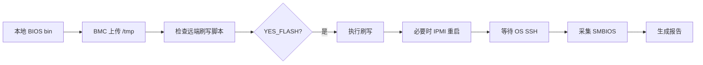

# 工作 A 交接文档

## 1. 一句话总结

本窗口完成了一个面向内网 Windows + 服务器 BMC/OS 环境的 BIOS/SMBIOS“可见式验证闭环”MVP：由内网 Agent 按标准化步骤上传本地 BIOS、检查并执行 BMC 刷写脚本、等待 OS 回来、采集 SMBIOS 日志并生成本地报告；当前 PPT 应重点讲“从人工流程沉淀为可见式 Agent 验证闭环”，不要讲 500 次重启压测脚本。

确定事项：

- 当前最终主包是 `firmware-ai-loop-menu.zip`。
- 当前主流程已经去掉 Jenkins 下载，因为用户反馈 Jenkins 有保护机制，无法直接下载。
- 当前入口只保留两条真实可跑流程：本地 BIOS 刷写 + OS SMBIOS 采集、只做 OS SMBIOS 采集。
- 当前验证闭环定位是“内网 Agent 执行可见流程”，不是 Jenkins/Gerrit/自动修代码/无人值守平台。

需要注意：

- 根目录存在 `reboot_500_loop.sh`，这是另一个独立话题的重启压测脚本，不属于本次 PPT 要讲的 BIOS/SMBIOS 验证闭环。

## 2. 背景与问题

用户是服务器 BIOS/UEFI 开发场景，原始手工流程大致为：

1. 用 MobaXterm 或 PuTTY 工具把 BIOS bin 上传到远端 `/tmp`。
2. SSH 到 BMC 或目标控制端执行已有刷写脚本。
3. 等待刷写与校验完成。
4. 机器重启或由脚本/BMC 触发重启。
5. 等服务器进入 OS。
6. 手动执行 `dmidecode` 和相关命令。
7. 人工检查 SMBIOS 字段是否符合本次 BIOS 需求。

最初目标曾经是做一个全自动 Python 闭环工具：

```text
deploy -> flash -> reboot -> wait OS -> collect -> compare -> report
```

但在内网验证中发现几个现实问题：

- 内网环境强依赖 Windows + MobaXterm/PuTTY，OpenSSH/sshpass/WSL 等环境不可假设。
- 用户更需要“可见式流程”：每一步要能看到命令、输出、进度和下一步，而不是脚本在后台黑盒执行。
- Jenkins 下载 BIOS 的页面存在保护机制，直接从脚本/Agent 下载不可用。
- 刷写脚本通常已经在 BMC `/tmp`，不应该每次都要求本地上传脚本。
- 最后 SMBIOS 对比不应拿 example baseline 做真实判定，真实判定应来自本次 BIOS 需求。

因此方案从“全自动脚本平台”收敛为：

```text
内网 Agent 可见式流程
  + PuTTY/plink/pscp 作为 Windows 侧连接工具
  + BMC 远端已有刷写脚本优先复用
  + OS 侧 dmidecode 采集和日志归档
  + 后续接入真实需求规则做判定
```

## 3. 当前已经完成的工作

### 3.1 项目包与压缩包

当前工作区：

```text
/Users/tzy/code/smbios_verfiy
```

当前主包目录：

```text
firmware-ai-loop/
```

当前交付 zip：

```text
firmware-ai-loop-menu.zip
```

包内主要内容：

```text
firmware-ai-loop/START_HERE.md
firmware-ai-loop/INNER_AGENT_PROMPT.md
firmware-ai-loop/README.md
firmware-ai-loop/AGENTS.md
firmware-ai-loop/AGENT_VISIBLE_RUNBOOK.md
firmware-ai-loop/skills/start-menu/SKILL.md
firmware-ai-loop/skills/bmc-bios-flash/SKILL.md
firmware-ai-loop/skills/os-smbios-collect/SKILL.md
firmware-ai-loop/tools/windows/plink.exe
firmware-ai-loop/tools/windows/pscp.exe
firmware-ai-loop/scripts/compare_smbios.py
firmware-ai-loop/config/expected_smbios.example.json
```

### 3.2 当前固定入口

当前入口只保留两条流程。

流程 1：

```text
本地 BIOS 刷写 + OS SMBIOS 采集
```

目标动作：

```text
用户提供本地 BIOS bin 路径
-> BMC 上传 BIOS
-> 优先使用 BMC /tmp 已有刷写脚本
-> 用户确认 YES_FLASH
-> 执行刷写
-> 如果脚本不带重启，则 BMC IPMI 重启
-> 等 OS SSH 回来
-> OS 采集 SMBIOS
-> 本地生成报告
```

流程 2：

```text
只做 OS SMBIOS 采集
```

目标动作：

```text
登录 OS
-> 执行 dmidecode
-> 远端生成合并日志
-> 下载到本地 logs/<run_id>/
-> 删除远端临时文件
-> 生成本地报告
```

### 3.3 BMC 刷写 skill

文件：

```text
firmware-ai-loop/skills/bmc-bios-flash/SKILL.md
```

已定义行为：

- 使用用户提供的 `LOCAL_BIOS_PATH` 作为唯一刷写 BIOS。
- 计算并展示本地 BIOS 文件大小和 SHA256。
- 上传到 BMC：

```text
/tmp/TriRiverV5_test.bin
```

- 优先在 BMC `/tmp` 查找已有脚本：

```text
/tmp/updatev5.sh
/tmp/updateV5.sh
/tmp/autoupdatebiosV5.sh
/tmp/flash_bios.sh
```

- 如果远端只有一个候选，直接使用并展示前 80 行。
- 如果远端多个候选，标记 `BLOCKED`，要求用户选择。
- 如果远端没有脚本，才要求本地 fallback：

```text
.\updatev5.sh
.\autoupdatebiosV5.sh
.\flash_bios.sh
```

- 刷写前必须等待用户精确回复：

```text
YES_FLASH
```

- 刷写后检查 `flash.log`：

成功信号：

```text
SUCCESS / PASS / Verify complete / Verify Complete / verified / Verified
```

失败信号：

```text
FAIL / FAILED / ERROR / Error / error
```

- 如果脚本没有重启/上电逻辑，刷写成功后执行：

```text
ipmitool chassis bootdev bios; ipmitool chassis power cycle
```

### 3.4 OS SMBIOS 采集 skill

文件：

```text
firmware-ai-loop/skills/os-smbios-collect/SKILL.md
```

已定义行为：

- 默认 OS：

```text
100.20.175.225:22 root/111111
```

- 有界等待 OS SSH：最多 60 次，每次 20 秒，不允许无限循环。
- 采集 Type：

```text
1 2 3 4 8 9 12 17 41
```

- 远端临时文件：

```text
/tmp/smbios_collect_<run_id>.txt
```

- 本地合并日志：

```text
logs/<run_id>/dmidecode_types_1_2_3_4_8_9_12_17_41.txt
```

- 每个 Type 使用固定分隔符：

```text
===== DMI TYPE <n> BEGIN =====
...
===== DMI TYPE <n> END =====
```

- 下载后删除远端临时文件。
- 当前仍会尝试运行：

```text
scripts/compare_smbios.py
```

### 3.5 compare 脚本

文件：

```text
firmware-ai-loop/scripts/compare_smbios.py
```

已知能力：

- 可解析合并 dmidecode 日志。
- 可根据 expected JSON 生成：

```text
verify_report.json
summary.md
```

当前局限：

- 当前 README 和 OS skill 中仍写着优先使用 `config/expected_smbios.json`，否则使用 `config/expected_smbios.example.json`。
- 用户后续明确指出：不应一直跟样例 expected 做对比，没意义。
- 本窗口仅形成了结论，还没有把 compare 流程改成 `smbios_requirements.json` 或“无规则只采集不判定”。

## 4. 关键技术/业务结论

### 4.1 已确定结论

1. Jenkins 流程应删除。

原因：

- 用户反馈 Jenkins 页面有保护机制，直接下载不了。
- 当前包已经删除 `skills/jenkins-bios-fetch/SKILL.md`。
- 当前入口不再出现 Jenkins。

证据：

```text
firmware-ai-loop/README.md
firmware-ai-loop/START_HERE.md
firmware-ai-loop/skills/start-menu/SKILL.md
```

2. 当前真实入口只有两条。

```text
1. 本地 BIOS 刷写 + OS SMBIOS 采集
2. 只做 OS SMBIOS 采集
```

3. 刷写前必须可见、可确认。

要求：

- 展示 BIOS 路径、大小、SHA256、远端路径。
- 展示远端刷写脚本前 80 行。
- 检查脚本是否像 BIOS update 脚本。
- 检查脚本是否自带重启逻辑。
- 用户回复 `YES_FLASH` 才能刷写。

4. 刷写脚本优先使用 BMC `/tmp` 现有脚本。

用户反馈：

- 刷写脚本常驻 BMC `/tmp`。
- 不应每次要求本地上传脚本。

当前实现：

```text
/tmp/updatev5.sh
/tmp/updateV5.sh
/tmp/autoupdatebiosV5.sh
/tmp/flash_bios.sh
```

5. 如果脚本没有重启逻辑，刷写成功后由 BMC 侧 IPMI 重启。

当前命令：

```text
ipmitool chassis bootdev bios; ipmitool chassis power cycle
```

6. Agent 必须每一步反馈。

固定反馈格式：

```text
步骤:
结果: PASS / FAIL / BLOCKED
执行命令:
关键输出:
下一步:
```

7. SMBIOS 判定不能再依赖 example baseline。

用户观点：

- example 只是格式样例。
- 真正的 PASS/FAIL 应该来自“本次 BIOS 需求”。

建议方向：

```text
config/smbios_requirements.json
```

或：

```text
无规则 -> 只生成采集证据和 REVIEW，不做 PASS/FAIL
有规则 -> 根据真实需求规则判断 PASS/FAIL
```

### 4.2 推测或待确认结论

1. 远端刷写脚本名称可能以 `updatev5`、`autoupdatebiosV5`、`flash_bios` 类似形式存在。

确定依据：

- 用户截图和描述中出现过类似 `autoupdatebiosV5.sh`。
- 当前 skill 中列出了四个候选。

仍需确认：

- 内网真实 BMC `/tmp` 中稳定脚本名是什么。

2. 刷写成功信号关键词可能不完全可靠。

当前关键词：

```text
SUCCESS / PASS / Verify complete / verified
```

仍需确认：

- 公司真实刷写脚本在成功/失败时输出什么文本。

3. OS 采集 Type 列表是否覆盖所有需求。

当前采集：

```text
1 2 3 4 8 9 12 17 41
```

来源：

- 用户要求采集这些 Type。

仍需确认：

- 后续 PPT 是否要强调 Type 9/11/41，还是当前已扩展 Type 集合。

## 5. 重要证据、文件、代码路径

### 5.1 最终工具包

```text
/Users/tzy/code/smbios_verfiy/firmware-ai-loop-menu.zip
```

用途：

- 给内网环境拷贝使用。

### 5.2 入口文档

```text
/Users/tzy/code/smbios_verfiy/firmware-ai-loop/START_HERE.md
```

证据点：

- 明确入口是两条流程。
- 明确本地 BIOS 路径就是刷写 bin。
- 明确 BMC 和 OS 默认参数。
- 明确远端脚本优先策略。
- 明确刷写前确认和 `YES_FLASH`。

### 5.3 给内网 Agent 的总 Prompt

```text
/Users/tzy/code/smbios_verfiy/firmware-ai-loop/INNER_AGENT_PROMPT.md
```

证据点：

- 要求 Agent 不跑自由组合。
- 要求每步可见反馈。
- 要求有界等待，不允许无限循环。
- 明确刷写脚本策略和 OS 采集范围。

### 5.4 BMC 刷写 Skill

```text
/Users/tzy/code/smbios_verfiy/firmware-ai-loop/skills/bmc-bios-flash/SKILL.md
```

证据点：

- 本地 BIOS 身份确认：路径、大小、SHA256。
- 搜索 BMC `/tmp` 远端脚本。
- 远端唯一脚本直接使用。
- 多脚本或无脚本的 BLOCKED 规则。
- 刷写日志成功/失败关键词。
- 无重启逻辑时执行 BMC IPMI 重启。

### 5.5 OS 采集 Skill

```text
/Users/tzy/code/smbios_verfiy/firmware-ai-loop/skills/os-smbios-collect/SKILL.md
```

证据点：

- 有界等待 OS SSH。
- 采集 Type 1/2/3/4/8/9/12/17/41。
- 合并日志格式。
- 删除远端临时文件。
- 当前仍调用 compare 脚本。

### 5.6 本地 compare 脚本

```text
/Users/tzy/code/smbios_verfiy/firmware-ai-loop/scripts/compare_smbios.py
```

证据点：

- 可生成 `verify_report.json` 和 `summary.md`。
- 当前适配 expected JSON，不等同于真实需求规则。

### 5.7 两页草稿文案

```text
/Users/tzy/code/smbios_verfiy/BIOS_SMBIOS_SUMMARY_2SLIDES.md
```

说明：

- 这是本窗口之前写的两页中文 PPT 文案。
- 已经修正为只讲 BIOS/SMBIOS 验证闭环，不讲 500 次重启脚本。
- 可作为另一个窗口做 PPT 的初稿材料，但建议结合本交接文档再精炼。

### 5.8 明确不要放入本 PPT 的旁支文件

```text
/Users/tzy/code/smbios_verfiy/reboot_500_loop.sh
```

说明：

- 这是另一个问题的 Linux 本机 500 次重启压测脚本。
- 用户已明确指出“不要写 500 次这个脚本，我说前面那个验证闭环”。
- 最终 PPT 不要把这个脚本作为主内容。

## 6. 适合放进 PPT 的候选页

### Slide 候选 1：从人工验证到可见式闭环

Slide 标题：

```text
BIOS/SMBIOS 验证闭环：从人工操作到可见式 Agent 流程
```

本页要表达的核心结论：

```text
当前方案不是做大平台，而是把现有 BIOS 验证人工步骤沉淀成可执行、可观察、可复用的最小闭环。
```

3-5 个 bullet：

- 原流程依赖人工：上传 BIOS、执行刷写、等待 OS、采集 dmidecode、人工检查。
- 当前方案使用内网 Agent 按标准步骤执行，并在每一步反馈命令和关键输出。
- 高风险动作保留人工确认：刷写前必须 `YES_FLASH`。
- 输出从零散终端结果变成可归档日志与报告。
- 先跑通内网 MVP，再扩展真实需求规则和 before/after 对比。

推荐图示/流程图/表格：

```text
人工流程 vs Agent 可见式闭环 对比表
```

或流程图：

```text
Local BIOS -> BMC Upload -> Script Check -> YES_FLASH -> Flash -> Reboot -> OS Collect -> Report
```

可以引用的证据或文件路径：

```text
firmware-ai-loop/START_HERE.md
firmware-ai-loop/README.md
firmware-ai-loop/skills/start-menu/SKILL.md
```

确定/推测：

- 确定：当前入口和流程已经写入文件。
- 推测：PPT 听众可能更关心“为什么不直接全自动”，可用“可见、可控、先 MVP”解释。

### Slide 候选 2：当前 MVP 的流程设计

Slide 标题：

```text
MVP 流程：本地 BIOS 刷写 + OS SMBIOS 采集
```

本页要表达的核心结论：

```text
当前 MVP 只保留真实可跑路径：本地 BIOS 输入，BMC 侧刷写，OS 侧采集，报告产出。
```

3-5 个 bullet：

- 输入：本地 BIOS bin 路径、BMC 登录信息、OS 登录信息。
- BMC 阶段：上传 BIOS，优先复用 `/tmp` 已有刷写脚本，检查脚本内容。
- 风险门禁：展示 BIOS SHA256 和脚本内容，用户确认后才刷写。
- OS 阶段：等待 SSH 恢复，采集 Type 1/2/3/4/8/9/12/17/41。
- 输出：合并 dmidecode 日志、`summary.md`、`verify_report.json`。

推荐图示/流程图/表格：



可以引用的证据或文件路径：

```text
firmware-ai-loop/skills/bmc-bios-flash/SKILL.md
firmware-ai-loop/skills/os-smbios-collect/SKILL.md
```

确定/推测：

- 确定：流程和命令模板已在 skill 中定义。
- 推测：真实刷写脚本的成功关键词可能需要内网实际验证后微调。

### Slide 候选 3：为什么去掉 Jenkins 和自动化黑盒

Slide 标题：

```text
方案收敛：去掉 Jenkins 下载，保留可见式执行
```

本页要表达的核心结论：

```text
Jenkins 下载受保护机制影响，不适合作为当前 MVP 的入口；内网第一版应优先保障可执行、可检查、可追踪。
```

3-5 个 bullet：

- Jenkins 页面存在保护机制，脚本/Agent 直接下载不可用。
- 当前改为使用“用户已下载好的本地 BIOS bin”，减少不可控依赖。
- PuTTY/plink/pscp 已在内网验证可连通 BMC 和 OS，适合作为当前执行通道。
- 每一步必须反馈，避免后台自动化不可见、失败难定位。
- 高风险刷写动作不交给模型自行决定，必须人工确认。

推荐图示/流程图/表格：

```text
早期设想 vs 当前收敛方案
列：Jenkins 下载、自动化程度、可见性、风险控制、当前状态
```

可以引用的证据或文件路径：

```text
firmware-ai-loop/README.md
firmware-ai-loop/AGENTS.md
firmware-ai-loop/INNER_AGENT_PROMPT.md
```

确定/推测：

- 确定：Jenkins skill 已删除，当前包内没有 `jenkins-bios-fetch`。
- 推测：后续如 Jenkins 认证机制可解决，可重新设计“产物获取”模块，但不属于当前 MVP。

### Slide 候选 4：SMBIOS 采集与判定策略

Slide 标题：

```text
SMBIOS 验证：先保留证据，再接入真实需求规则
```

本页要表达的核心结论：

```text
example expected 不能作为真实验收标准；第一步应稳定采集原始证据，后续按本次 BIOS 需求定义规则判断 PASS/FAIL/REVIEW。
```

3-5 个 bullet：

- 当前采集覆盖 Type 1/2/3/4/8/9/12/17/41。
- 合并日志带固定分隔符，便于归档和后处理。
- example expected 只适合做格式示例，不适合做真实对比。
- 建议新增 `smbios_requirements.json`：按本次需求定义 equals/contains/regex/exists 等规则。
- 无规则时输出 `REVIEW`，有规则时输出 `PASS/FAIL`。

推荐图示/流程图/表格：

```text
采集证据 -> 需求规则 -> 判定报告
```

或表格：

```text
阶段 | 当前能力 | 后续增强
采集 | dmidecode 合并日志 | before/after 对比
判定 | expected 示例对比 | requirements 规则
报告 | summary/report | 需求级 PASS/FAIL/REVIEW
```

可以引用的证据或文件路径：

```text
firmware-ai-loop/skills/os-smbios-collect/SKILL.md
firmware-ai-loop/scripts/compare_smbios.py
firmware-ai-loop/config/expected_smbios.example.json
```

确定/推测：

- 确定：用户明确认为不要一直和样例比对。
- 确定：当前代码尚未完全改成 requirements 规则。
- 推测：PPT 可以把 requirements 作为下一阶段规划，而不要声称已经完成。

### Slide 候选 5：风险控制与边界

Slide 标题：

```text
风险控制：高风险动作可见、可停、可追溯
```

本页要表达的核心结论：

```text
BIOS 刷写是高风险动作，当前 MVP 的核心不是“全自动”，而是把风险点前置并强制确认。
```

3-5 个 bullet：

- 刷写前确认 BIOS 身份：路径、大小、SHA256、远端路径。
- 刷写脚本优先复用远端唯一脚本，多脚本/无脚本时 BLOCKED。
- 刷写前展示脚本内容，避免拿错脚本。
- 刷写失败、日志无成功信号、出现 error/fail 时立即停止。
- 等待 OS 使用有界循环，不允许无限等待。

推荐图示/流程图/表格：

```text
风险点 -> 控制动作 -> 失败处理
```

可以引用的证据或文件路径：

```text
firmware-ai-loop/skills/bmc-bios-flash/SKILL.md
firmware-ai-loop/skills/os-smbios-collect/SKILL.md
firmware-ai-loop/AGENTS.md
```

确定/推测：

- 确定：这些规则已写入 skill 文档。
- 推测：真实内网执行后可能需要调整成功/失败关键词。

## 7. 风险与注意事项

### 7.1 当前代码/文档层面的风险

1. compare 逻辑还没有完全切换到“真实需求规则”。

当前状态：

- `os-smbios-collect` 仍选择 `config/expected_smbios.json` 或 `expected_smbios.example.json`。
- 用户已经明确指出 example 对比没意义。

建议：

- PPT 中不要声称“真实 SMBIOS 判定已完成”。
- 应表述为：“当前已完成采集与报告链路；真实判定规则是下一步。”

2. 成功关键词可能不适配真实刷写脚本。

当前关键词：

```text
SUCCESS / PASS / Verify complete / verified
```

风险：

- 真实脚本可能输出不同成功标志。
- 如果没有明确成功信号，当前规则会 BLOCKED。

建议：

- PPT 中说“成功/失败关键词可配置或需按现场脚本校准”。

3. 远端脚本候选列表可能不完整。

当前候选：

```text
/tmp/updatev5.sh
/tmp/updateV5.sh
/tmp/autoupdatebiosV5.sh
/tmp/flash_bios.sh
```

风险：

- 真实脚本名可能不同。

建议：

- PPT 里不要写死所有脚本名作为唯一方案，可表达为“优先检查 /tmp 中约定刷写脚本”。

4. 当前包适配 Windows + PuTTY 工具链。

依赖：

```text
tools/windows/plink.exe
tools/windows/pscp.exe
```

风险：

- 如果现场机器不是 Windows 或 PuTTY 不可执行，需要改通道。

确定：

- 本窗口中用户已经在内网用 PuTTY/plink/pscp 跑通过简单连通和小文件上传。

5. 密码安全和内网便利之间存在取舍。

当前现场参数曾明确给出：

```text
BMC root/root
OS root/111111
```

用户态度：

- 内网优先跑通，不希望密码保护阻塞流程。

PPT 建议：

- 不要强调“明文密码”，可以说“参数由环境/交互提供，现场按内网规范处理”。

### 7.2 汇报内容风险

1. 不要把 `reboot_500_loop.sh` 放进本 PPT 主线。

原因：

- 用户明确纠正：本次汇报讲前面的验证闭环，不讲 500 次脚本。

2. 不要声称 Jenkins 闭环已经可用。

原因：

- Jenkins 下载流程已经删除。
- 用户反馈 Jenkins 有保护机制。

3. 不要声称“完全自动化无人值守刷写”。

原因：

- 方案核心是可见式 Agent 流程。
- 刷写前必须人工 `YES_FLASH`。

4. 不要声称“SMBIOS 自动判定已按真实需求完成”。

原因：

- 当前只完成采集和 example compare 能力。
- 真实 requirements 规则尚未实现。

## 8. 未完成/需要主窗口继续追问的问题

1. 最终 PPT 受众是谁？

需要确认：

- 是给领导看价值，还是给工程团队看落地细节？
- 决定 PPT 是偏业务收益还是偏技术流程。

2. 是否要把“真实需求规则”作为下一阶段重点？

建议追问：

```text
这次 PPT 要不要把 smbios_requirements.json 作为下一阶段规划重点？
```

3. SMBIOS 真实判定字段有哪些？

当前用户最早关注：

```text
Type9: Slot Designation / Current Usage / Bus Address
Type11: String values
Type41: Reference Designation / Device Type / Device Status / Bus Address
```

后来采集范围扩展到：

```text
Type 1/2/3/4/8/9/12/17/41
```

需要确认：

- PPT 中是否只讲 Type 9/11/41 作为示例？
- 还是讲当前实际采集 Type 集合？

4. 是否需要展示真实内网跑通证据？

已知：

- 用户曾反馈 BMC 和 OS 连通、简单 txt 上传已成功。
- BIOS 上传也曾反馈“跑通了，上传了已经”。

缺少：

- 完整“刷写 + OS 采集 + 报告”跑通证据。

建议：

- PPT 若要写成果，应区分“已验证链路”和“待内网完整验证”。

5. 是否要在 PPT 中出现具体 IP/用户名？

当前文档里有：

```text
BMC 100.20.174.151:22 root/root
OS 100.20.175.225:22 root/111111
```

建议：

- 对外汇报 PPT 可脱敏：`BMC_IP`、`OS_IP`。
- 内部技术评审可保留示例，但密码最好不要展示。

6. 是否需要把当前 skill 包重新打包？

当前 zip：

```text
firmware-ai-loop-menu.zip
```

注意：

- 本 handoff 没有重新打包。
- 若后续修改 compare 逻辑或需求规则，需要重新打包。

## 9. 推荐 PPT 页数与优先级

建议最终 PPT 中这部分占 4 页，最多 5 页。

### 优先级 P0：必须放

1. 背景与目标：从手工验证到可见式闭环

建议 1 页。

核心：

- 手工流程痛点。
- 为什么先做 MVP。
- 当前闭环边界。

2. 当前流程设计：本地 BIOS -> BMC -> OS -> 报告

建议 1 页。

核心：

- 画主流程图。
- 展示两条入口。
- 强调 `YES_FLASH` 和每步反馈。

3. 风险控制与可追踪性

建议 1 页。

核心：

- BIOS 身份确认。
- 远端脚本检查。
- 刷写失败停止。
- 有界等待 OS。

### 优先级 P1：建议放

4. SMBIOS 采集与真实需求判定规划

建议 1 页。

核心：

- 当前采集证据已经结构化。
- example baseline 不作为真实验收。
- 下一步接入 `smbios_requirements.json` 或 before/after。

### 优先级 P2：视篇幅放

5. 当前交付物与下一步计划

建议 0.5-1 页。

核心：

- `firmware-ai-loop-menu.zip`
- `START_HERE.md`
- `bmc-bios-flash`
- `os-smbios-collect`
- 下一步：内网完整跑通、校准刷写成功关键词、定义真实 SMBIOS 需求规则。

总页数建议：

```text
4 页最合适：
1. 背景与目标
2. MVP 闭环流程
3. 风险控制
4. SMBIOS 判定与下一步
```

如果领导汇报需要更短：

```text
2 页版本：
1. 方案总结和价值
2. 流程落地和下一步
```

