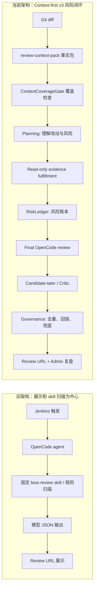

# 工作 A 交接文档

## 1. 一句话总结

本窗口已确认并对齐 AI Review 当前版本：最新可用基线是 `AI-REVIEW-bios-intranet-opencode-202605201728`；当前架构已从旧 PPT 里的“Jenkins + OpenCode + skills + 网页展示”升级为 `engine-v3 Context-first` 风险闭环，建议最终汇报用 2-3 页讲清楚“先给结论、架构对比、评测证据、下一步闭环”。

## 2. 背景与问题

用户最初关心两个问题：

1. `opencode` 的更新记录在哪里、AI Review 内嵌的 OpenCode 是什么版本、是否需要更新。
2. AI Review 本地源码、部署 zip、旧 PPT 内容之间版本不一致，用户不知道哪个是最新，后续还要基于当前真实架构更新汇报材料。

当前需要交接给下一个 Codex 窗口的任务不是制作 PPT，而是承接本窗口已经梳理出的事实、判断和汇报思路，后续再决定是否生成正式 PPT。

已有旧 PPT：

```text
/Users/tzy/Library/Containers/com.tencent.xinWeChat/Data/Documents/xwechat_files/wxid_x3btdx9w0qed21_11db/temp/drag/AI+Code+Review汇报_(1).pptx
```

用户还给了一张领导建议截图：

```text
/Users/tzy/Library/Containers/com.tencent.xinWeChat/Data/Documents/xwechat_files/wxid_x3btdx9w0qed21_11db/temp/RWTemp/2026-05/9e20f478899dc29eb19741386f9343c8/fe4efce36c5f816dd5508906b0e5a5b9.jpg
```

截图中能读到的核心建议：

- “金字塔原理”
- “先说结论”
- “标题是结论，总结到标题”
- “放数据框图”
- “先大结论/小结论”

确定事实：

- 旧 PPT 是 19 页，主题为 `AI Code Review 进展汇报`。
- 旧 PPT 的架构内容是之前阶段的架构，不能直接代表当前 `engine-v3`。
- 用户希望后续大概做 2-3 页更新汇报，先有大纲，再决定是否做 PPT。

推测/建议：

- 汇报对象可能偏管理层或领导，最好少讲实现细节，多讲“为什么当前更可靠、如何证明、下一步怎么收敛”。
- 由于领导建议强调金字塔原理，最终 PPT 标题应该全部写成结论句，而不是“总体方案/未来方向”这种目录标题。

## 3. 当前已经完成的工作

### 3.1 OpenCode 版本确认

已确认当前最新部署包中内嵌的 OpenCode 是：

```text
opencode-windows-x64@1.15.4
```

来源在最新部署包内：

```text
runtime/opencode/OPENCODE-RUNTIME.txt
PACKAGE-MANIFEST.txt
```

包内 manifest 显示：

```text
Bundled runtime:
- Node.js v24.15.0 Windows x64 minimal runtime
- Real OpenCode Windows x64 executable from opencode-windows-x64@1.15.4
```

外部查询结果：

- npm 上 `opencode-windows-x64` 最新已到 `1.15.6`。
- 官方 changelog/GitHub release 也显示 `v1.15.6` 已发布。

判断：

- 不紧急热更，因为当前 AI Review 使用的是非交互 `opencode run --pure --agent ai-review --model ... --file ...` 路径。
- 下一次重新打内网包时建议把 OpenCode runtime 从 `1.15.4` 更新到 `1.15.6`，并跑 Windows/Jenkins smoke。

### 3.2 AI Review 版本对齐

本窗口发现之前版本口径混乱：

- 源码仓库 `package.json` 还是 `0.1.0`。
- 本地源码 `main` 一度停在 `fa7287c`。
- 最新部署 zip 在 `personal-coach` 目录下，不在 AI Review 标准 packages 目录。
- 最新 zip manifest 标的 commit marker 是 `49fd2b4`，但当前本地 git 历史查不到这个 commit。

已执行的对齐动作：

1. 将最新部署包复制回标准目录：

```text
/Users/tzy/code/ai-review/packages/AI-REVIEW-bios-intranet-opencode-49fd2b4-202605201728.zip
```

2. 将源码仓库运行代码对齐到部署包内容，排除 runtime 二进制和 package-only manifest。

3. 新增版本记录文件：

```text
/Users/tzy/code/ai-review/AI-REVIEW-bios/VERSION.md
```

4. 更新版本号：

```text
package.json version = 0.1.20260520-1728
```

5. 更新项目记忆：

```text
/Users/tzy/code/ai-review/AI-REVIEW-bios/PROJECT_MEMORY.md
/Users/tzy/code/ai-review/SESSION_MEMORY.md
```

注意：`SESSION_MEMORY.md` 在仓库外，不属于 `AI-REVIEW-bios` git。

已提交：

```text
6ea9bc6 Sync source with 202605201728 deployment package
```

### 3.3 已验证的测试

已运行：

```text
npm run test:v3-closure
```

结果：

```text
v3 closure tests passed
```

还做过 `node --check` 检查 `review/engine-v3` 拆分后的模块，结果通过。

### 3.4 已分析旧 PPT 内容

旧 PPT 共 19 页，抽取到的结构如下：

1. 封面：AI Code Review 进展汇报
2. 目录：当前进度 / 总体方案 / Skills 优化 / 未来方向
3-4. 当前进度
5-11. 总体方案、旧流程/现流程、Jenkins 触发、Review 网页、AI 行内建议、批注状态
12-15. Skills 优化、旧新版 skill 对比、测试集来源
16-18. 未来方向、当前问题、下一步工作
19. 结束页

旧 PPT 主线：

- Jenkins 触发后生成唯一 Review URL。
- 团队可在网页查看 diff、AI 评论、人工批注、报告。
- 后台切换为 OpenCode agent。
- 固定使用 `bios-review skill`。
- 模型输出固定 JSON，解析后变成行内评论。
- skills 从固定顺序扫描优化为按改动类型选择重点规则、aggregator 做证据判断。

当前需要替换的点：

- 旧 PPT 的“skills/aggregator”不能继续作为当前架构中心。
- 当前架构中心已经变为 `Context-first engine-v3`：事实包、上下文覆盖检查、planning、证据补齐、riskLedger、candidate-later/critic、governance、URL/admin 复盘。

### 3.5 已写初版汇报大纲

已经创建并提交：

```text
/Users/tzy/code/ai-review/AI-REVIEW-bios/docs/AI_CODE_REVIEW_REPORT_OUTLINE_20260524.md
```

提交：

```text
6db4892 Add AI Code Review presentation outline
```

这个大纲推荐 3 页：

1. 结论页：AI Review 已从“能展示结果”升级为“能解释、能追踪、能复盘的审查闭环”。
2. 新旧架构对比页：新架构把“规则扫描”后移，把“上下文理解”前置。
3. 当前价值与下一步页：下一步重点不是再加规则，而是扩样本、稳评测、接入评审闭环。

## 4. 关键技术/业务结论

### 4.1 当前最新版本口径

确定：

```text
当前统一基线：AI-REVIEW-bios-intranet-opencode-202605201728
当前源码 HEAD：6db4892 Add AI Code Review presentation outline
当前运行代码同步提交：6ea9bc6 Sync source with 202605201728 deployment package
当前部署包：/Users/tzy/code/ai-review/packages/AI-REVIEW-bios-intranet-opencode-49fd2b4-202605201728.zip
```

确定：

- `49fd2b4` 只是部署包 manifest 内的旧 commit marker。
- 当前本地 git 历史查不到 `49fd2b4`。
- 后续不应靠散落 zip 文件名或 `49fd2b4` 判断新旧，应该以 git `main` + `VERSION.md` 为准。

### 4.2 当前架构已变为 Context-first v3

确定的当前主流程来自：

```text
/Users/tzy/code/ai-review/AI-REVIEW-bios/docs/CURRENT-ARCHITECTURE.md
```

主流程：

```text
Git diff
-> review-context-pack.json
-> ContextCoverageGate
-> planning round 1
-> read-only context fulfillment
-> optional planning round 2
-> final OpenCode review
-> optional candidate-later verification
-> validator / dedupe / note promotion
-> Review Server session URL
```

架构核心变化：

- 旧阶段：更偏“Jenkins 触发 + OpenCode agent + skills + JSON + 网页展示”。
- 当前阶段：更偏“上下文事实包 + planning 理解 + evidence fulfillment + riskLedger 闭环 + governance 防丢失/防误报”。

### 4.3 `bios-review skill` 当前不是规则大全

确定：

- 当前 `skills/bios-review/SKILL.md` 更像最小审查契约和输出标准。
- 当前架构不再建议把 skill/规则直接当成最终结论。
- candidate/rule/semantic lead 只作为高优先级线索，必须经过模型和证据闭环。

可用于汇报的表达：

> 现在不是“规则越多越好”，而是让规则成为可追踪线索，由模型基于上下文证据判断，工具层保证每条风险都有处置结果。

### 4.4 当前版本解决的是“看到风险但不展示”的工程断点

确定依据来自：

```text
/Users/tzy/code/ai-review/AI-REVIEW-bios/docs/EVAL-COMPARISON-SUMMARY.md
```

关键结论：

- 早期 v3 baseline 并非完全不理解代码；在 4 个 reverse-fix case 中，planning/disposition 已触达 4/4 关键风险，但正式 finding 只有 1/4。
- 当前优化目标是让模型看到的风险不再黑盒消失：进入 formal finding、reviewNote、dismissed disposition 或 admin diagnostics。
- 当前代表 case：RF001 / RF003 / RF004 均有正式命中或可见复核项。
- NEG001 / NEG002 正式误报保持 0。

注意：

- 这些是代表样本，不等于已经证明跨所有 BIOS 平台或所有问题类型泛化。
- PPT 中可以说“代表 case 已闭环、链路可追踪”，不建议说“准确率已经全面达标”。

### 4.5 交付入口保持兼容

确定：

- Jenkins 触发方式没有作为这次架构升级的主要变化点。
- Review URL 仍然是团队查看结果、批注、解决状态、报告下载的入口。
- 当前网页和 admin 页面新增了更多可解释信息，例如 planning、coverage、risk disposition、candidate disposition、critic 信息。

适合 PPT 的表达：

> 使用入口不变，内部审查链路升级：团队仍通过 Review URL 协作，但后台已经从结果展示链路升级为可追踪的风险闭环。

## 5. 重要证据、文件、代码路径

### 5.1 版本与包

```text
/Users/tzy/code/ai-review/AI-REVIEW-bios/VERSION.md
/Users/tzy/code/ai-review/AI-REVIEW-bios/package.json
/Users/tzy/code/ai-review/packages/AI-REVIEW-bios-intranet-opencode-49fd2b4-202605201728.zip
```

包内关键文件：

```text
PACKAGE-MANIFEST.txt
runtime/opencode/OPENCODE-RUNTIME.txt
```

当前包信息：

```text
Packaged: 2026-05-20 17:28:47 +0800
Original package branch: codex/ai-review-v3-bios-context
Original package commit marker: 49fd2b4
Node runtime: v24.15.0 Windows x64
OpenCode runtime: opencode-windows-x64@1.15.4
```

### 5.2 架构文档

```text
/Users/tzy/code/ai-review/AI-REVIEW-bios/docs/CURRENT-ARCHITECTURE.md
/Users/tzy/code/ai-review/AI-REVIEW-bios/PROJECT_MEMORY.md
/Users/tzy/code/ai-review/AI-REVIEW-bios/docs/CHANGELOG.md
/Users/tzy/code/ai-review/AI-REVIEW-bios/docs/EVAL-COMPARISON-SUMMARY.md
```

### 5.3 已写的汇报大纲

```text
/Users/tzy/code/ai-review/AI-REVIEW-bios/docs/AI_CODE_REVIEW_REPORT_OUTLINE_20260524.md
```

### 5.4 当前核心代码路径

主引擎：

```text
/Users/tzy/code/ai-review/AI-REVIEW-bios/review/engine-v3/run-review.mjs
```

拆分出的 engine-v3 模块：

```text
/Users/tzy/code/ai-review/AI-REVIEW-bios/review/engine-v3/lib/file-utils.mjs
/Users/tzy/code/ai-review/AI-REVIEW-bios/review/engine-v3/lib/git-utils.mjs
/Users/tzy/code/ai-review/AI-REVIEW-bios/review/engine-v3/lib/json-output.mjs
/Users/tzy/code/ai-review/AI-REVIEW-bios/review/engine-v3/prompts/review-prompts.mjs
/Users/tzy/code/ai-review/AI-REVIEW-bios/review/engine-v3/postprocess/risk-trace.mjs
/Users/tzy/code/ai-review/AI-REVIEW-bios/review/engine-v3/postprocess/critic-adjudication.mjs
```

管线模块：

```text
/Users/tzy/code/ai-review/AI-REVIEW-bios/review/pipeline/context-coverage-gate.js
/Users/tzy/code/ai-review/AI-REVIEW-bios/review/pipeline/evidence-pack.js
/Users/tzy/code/ai-review/AI-REVIEW-bios/review/pipeline/risk-ledger.js
/Users/tzy/code/ai-review/AI-REVIEW-bios/review/pipeline/candidate-generator.js
/Users/tzy/code/ai-review/AI-REVIEW-bios/review/pipeline/finding-governance.js
```

Web/Admin：

```text
/Users/tzy/code/ai-review/AI-REVIEW-bios/server/server.js
/Users/tzy/code/ai-review/AI-REVIEW-bios/server/services/session-store.js
/Users/tzy/code/ai-review/AI-REVIEW-bios/web/app.js
/Users/tzy/code/ai-review/AI-REVIEW-bios/web/admin.js
/Users/tzy/code/ai-review/AI-REVIEW-bios/web/styles.css
```

Skill：

```text
/Users/tzy/code/ai-review/AI-REVIEW-bios/skills/bios-review/SKILL.md
/Users/tzy/code/ai-review/AI-REVIEW-bios/skills/bios-review/references/bios-coding-guide.md
/Users/tzy/code/ai-review/AI-REVIEW-bios/skills/bios-review/references/style.md
```

测试：

```text
/Users/tzy/code/ai-review/AI-REVIEW-bios/tools/test-v3-closure.mjs
```

### 5.5 旧 PPT 和领导建议图

旧 PPT：

```text
/Users/tzy/Library/Containers/com.tencent.xinWeChat/Data/Documents/xwechat_files/wxid_x3btdx9w0qed21_11db/temp/drag/AI+Code+Review汇报_(1).pptx
```

领导建议图：

```text
/Users/tzy/Library/Containers/com.tencent.xinWeChat/Data/Documents/xwechat_files/wxid_x3btdx9w0qed21_11db/temp/RWTemp/2026-05/9e20f478899dc29eb19741386f9343c8/fe4efce36c5f816dd5508906b0e5a5b9.jpg
```

## 6. 适合放进 PPT 的候选页

### Slide 1：AI Review 已升级为“可解释、可追踪、可复盘”的审查闭环

本页要表达的核心结论：

> 当前进展不是简单优化网页或 prompt，而是把 AI Review 从结果展示链路升级为上下文优先的风险闭环。

3-5 个 bullet：

- 交付入口保持不变：Jenkins 触发后仍生成 Review URL，团队可在网页查看 diff、AI 评论、人工批注和状态。
- 内部审查链路升级：新增 context pack、ContextCoverageGate、planning、evidence fulfillment、riskLedger、governance。
- 模型看到的风险不再黑盒消失：每条风险进入 formal finding、reviewNote、dismissed disposition 或 admin diagnostics。
- 代表 case 已闭环：RF001 / RF003 / RF004 有正式命中或可见复核项；NEG001 / NEG002 正式误报保持 0。

推荐图示/流程图/表格：

- 三段式升级图：

```text
旧阶段：Jenkins URL + OpenCode agent + skills + JSON 展示
  ↓
当前阶段：Context-first engine-v3 + RiskLedger + Evidence + Governance
  ↓
结果：风险可见、可追踪、可复盘
```

- 右侧放 3 个指标框：
  - 风险可追踪
  - 代表 case 命中
  - 误报控制

可以引用的证据或文件路径：

```text
docs/CURRENT-ARCHITECTURE.md
docs/EVAL-COMPARISON-SUMMARY.md
VERSION.md
```

确定/推测标注：

- 确定：当前架构和版本路径。
- 确定：代表 case 和 negative case 的现有文档结论。
- 推测：最终对领导最有说服力的表达应该是“闭环能力提升”，而不是代码模块细节。

### Slide 2：新架构把“规则扫描”后移，把“上下文理解”前置

本页要表达的核心结论：

> 当前架构的关键变化是先理解改动和上下文，再让规则/候选成为可验证线索，而不是让规则直接决定结论。

3-5 个 bullet：

- 旧架构中心：OpenCode agent + 固定 `bios-review skill` + 结构化 JSON + 网页展示。
- 新架构中心：`review-context-pack` 事实包 + 覆盖检查 + planning + 证据补齐 + riskLedger。
- 候选规则不直接生成问题，只作为 high-priority lead，经模型、证据、critic/governance 过滤。
- 每个 riskLedger 项必须被处置：confirmed finding、confirmation item 或 dismissed。
- Admin 页面支持复盘 planning、coverage、risk disposition、candidate disposition。

推荐图示/流程图/表格：

左右对比流程图：



也可以做成对比表：

| 对比项 | 旧架构 | 当前架构 |
| --- | --- | --- |
| 审查中心 | skill/规则扫描 | 上下文事实包 + planning |
| 风险来源 | skill 结果汇总 | planning + candidate + semantic lead |
| 输出失败处理 | 容易空结果/解析失败 | JSON 修复、风险回链、reviewNotes 兜底 |
| 误报控制 | aggregator 判断 | candidate-later + critic + governance |
| 复盘能力 | 看最终网页 | 看 planning、coverage、disposition |

可以引用的证据或文件路径：

```text
docs/CURRENT-ARCHITECTURE.md
review/engine-v3/run-review.mjs
review/pipeline/context-coverage-gate.js
review/pipeline/risk-ledger.js
review/engine-v3/prompts/review-prompts.mjs
web/admin.js
```

确定/推测标注：

- 确定：当前流程来自 `CURRENT-ARCHITECTURE.md` 和代码。
- 推测：旧架构可简化为“展示和 skill 扫描为中心”，这是从旧 PPT 文案提炼后的表达，不是旧代码完整实现图。

### Slide 3：下一步重点不是“再加规则”，而是扩样本、稳评测、接入评审闭环

本页要表达的核心结论：

> 现在的短板不是没有架构闭环，而是样本覆盖和稳定性证明还要继续做，Gerrit 接入应放在结果稳定后。

3-5 个 bullet：

- 已完成：Context-first v3、riskLedger、Review URL、Admin 复盘、代表 case 回放。
- 短期加强：扩充真实问题/误报样本，建立固定评测集和每次发包报告。
- 版本治理：后续以 git `main` + `VERSION.md` 为准，不再靠散落 zip 判断版本。
- Runtime 升级：下一次打包建议更新 `opencode-windows-x64` 到 `1.15.6` 并做 Windows smoke。
- 中期闭环：稳定后再同步 AI 评论到 Gerrit，把人工反馈反哺样本库。

推荐图示/流程图/表格：

三段路线图：

```text
当前已完成
Context-first v3 / RiskLedger / Review URL / Admin 复盘 / 代表 case 回放

短期要加强
真实样本 + 误报样本 / 固定评测集 / 版本化报告 / OpenCode runtime 更新

中期闭环
更多真实项目回放 / Gerrit 评论同步 / 人工反馈反哺样本库
```

也可以做成行动表：

| 模块 | 已有基础 | 下一步动作 |
| --- | --- | --- |
| 评测 | RF001/RF003/RF004、NEG001/NEG002 | 扩真实 commit、negative、分层统计 |
| 稳定性 | riskLedgerCoverage、unansweredRiskCount、candidateDispositions | 每次发包固定 smoke/eval |
| 交付 | `202605201728` 基线 | `VERSION.md` 固化版本，更新 OpenCode |
| 评审闭环 | Review URL 协作 | 稳定后同步 Gerrit |

可以引用的证据或文件路径：

```text
docs/EVAL-COMPARISON-SUMMARY.md
VERSION.md
docs/AI_CODE_REVIEW_REPORT_OUTLINE_20260524.md
tools/test-v3-closure.mjs
```

确定/推测标注：

- 确定：当前测试和版本对齐已完成。
- 确定：OpenCode runtime 当前是 `1.15.4`，npm 最新可到 `1.15.6`。
- 推测/建议：Gerrit 接入应放在稳定后，这是产品推进策略判断，不是代码约束。

### 可选备份 Slide：为什么不是“规则越多越好”

本页要表达的核心结论：

> 规则层应该提供线索，不应该越过上下文和模型判断直接生成正式问题。

3-5 个 bullet：

- 规则/candidate 只提供 high-priority lead。
- evidence fulfillment 补当前代码事实。
- final review 基于上下文独立判断。
- critic/governance 过滤候选误报。
- 不确定但有价值的风险进 reviewNotes，不直接变成 formal finding。

推荐图示/流程图/表格：

```text
规则线索
  -> 证据补齐
  -> 模型判断
  -> Critic / Governance
  -> finding / reviewNote / dismissed
```

可以引用的证据或文件路径：

```text
review/pipeline/candidate-generator.js
review/pipeline/evidence-pack.js
review/engine-v3/postprocess/critic-adjudication.mjs
review/engine-v3/postprocess/risk-trace.mjs
skills/bios-review/SKILL.md
```

确定/推测标注：

- 确定：当前代码中存在 candidate-later、critic、risk disposition、reviewNotes 等机制。
- 推测：这页适合作为备份页，不一定进入主汇报。

## 7. 风险与注意事项

### 7.1 不要夸大准确率

确定：

- 当前文档证明的是代表 case 和链路闭环改善。
- `docs/EVAL-COMPARISON-SUMMARY.md` 中的样本包括 RF001/RF003/RF004、NEG001/NEG002 等，不是全量平台统计。

注意：

- PPT 中可以说“代表 case 已验证”“风险不再黑盒消失”“可追踪性提升”。
- 不建议说“准确率已经全面达标”或“所有 BIOS 场景已泛化”。

### 7.2 `49fd2b4` 不是当前可追踪 git commit

确定：

- 最新部署包 manifest 中有 `49fd2b4`。
- 当前本地 git 历史查不到 `49fd2b4`。

注意：

- 汇报里如需讲版本，不要把 `49fd2b4` 当成当前源码 commit。
- 应讲 `202605201728` 基线，或者讲当前 git 提交 `6ea9bc6/6db4892`。

### 7.3 OpenCode runtime 不是最新

确定：

- 当前包内 OpenCode 是 `opencode-windows-x64@1.15.4`。
- 外部 npm 查询显示 `opencode-windows-x64` 已有 `1.15.6`。

注意：

- 可以作为下一步技术债，不建议作为当前 PPT 主结论。
- 如果后续要发新包，应同步更新 runtime 并测试。

### 7.4 旧 PPT 截图/内容可能过时

确定：

- 旧 PPT 架构页仍围绕旧流程、skills 优化、网页展示。
- 当前架构文档显示主流程已是 `Context-first v3`。

注意：

- 旧 PPT 可复用界面截图和 Jenkins/URL 协作说明。
- 架构图必须重画，不能沿用旧架构图。

### 7.5 不要把 Admin 诊断暴露成用户主体验

确定：

- Admin 页面用于内部复盘。
- 普通 Review URL 仍是用户/团队查看结果入口。

建议：

- PPT 中讲 Admin 是“内部可复盘/可诊断能力”，不要让人误解为普通用户必须看复杂诊断才能用。

## 8. 未完成/需要主窗口继续追问的问题

1. 最终 PPT 是直接改旧 PPT，还是新建 2-3 页补充 PPT？
   - 确定：用户当前要求不要直接做 PPT。
   - 待确认：后续窗口是否需要沿用旧 PPT 模板风格、还是只做新增页。

2. 汇报对象和时间长度是多少？
   - 推测：领导建议强调结论先行，可能是短汇报。
   - 待确认：是 3 分钟口头汇报、5-10 分钟项目进展，还是正式评审材料。

3. 是否需要在 PPT 中展示真实网页截图？
   - 旧 PPT 已有网页截图。
   - 待确认：是否要用当前最新网页重新截图，尤其是 Admin/riskLedger 页面。

4. 是否要更新 OpenCode 到 `1.15.6` 后再汇报？
   - 建议：PPT 可先讲当前版本和下一步，不必阻塞。
   - 若要发新包，则需要后续做 runtime 更新和 Windows/Jenkins 测试。

5. 是否要补更多评测数据？
   - 当前有代表 case 数据。
   - 若领导要求“准确率/召回率”的量化结论，需要扩大样本，并输出更正式的统计表。

6. 是否需要把 git 提交推到远端？
   - 当前本地 HEAD 是 `6db4892`，远端 `origin/main` 仍停在 `fa7287c`。
   - 本窗口没有执行 push。

7. 是否需要把仓库外的 `SESSION_MEMORY.md` 也纳入某种版本化记录？
   - 已更新该文件，但它不在 `AI-REVIEW-bios` git 中。
   - 如果需要跨机器同步，建议把关键信息保留在 `VERSION.md` 和 `PROJECT_MEMORY.md`，不要依赖仓库外文件。

## 9. 推荐 PPT 页数与优先级

建议最终 PPT 占 2-3 页。

优先级最高的 3 页：

1. 必选：结论页
   - 标题：`AI Review 已升级为“可解释、可追踪、可复盘”的审查闭环`
   - 作用：先给大结论，符合领导建议的金字塔原理。

2. 必选：新旧架构对比页
   - 标题：`新架构把“规则扫描”后移，把“上下文理解”前置`
   - 作用：回答“之前 PPT 是旧架构，现在到底变了什么”。

3. 推荐：当前价值与下一步页
   - 标题：`下一步重点不是再加规则，而是扩样本、稳评测、接入评审闭环`
   - 作用：回答“接下来怎么推进、如何证明有效”。

如果只能做 2 页：

1. 第 1 页：结论 + 关键证据指标框。
2. 第 2 页：新旧架构对比 + 下一步路线图。

如果能做 3 页：

- 按上面的 3 页完整展开。

如果需要备份页：

- 加 1 页“为什么不是规则越多越好”，用于回答追问，不一定放进正式主线。

最终建议：

- 主汇报 3 页最稳。
- 若汇报时间很短，压缩到 2 页，但不要删除“新旧架构对比图”。
